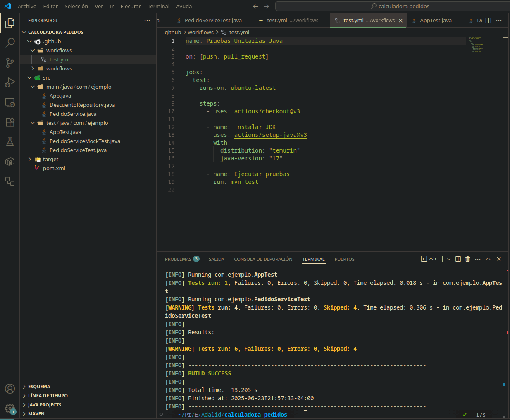

# Calculadora de Pedidos

## Equipo 2

- **Francisco Leiva**
- **Guillermo Torres**

## Preguntas Finales

### 1. ¿Qué te ayudaron a identificar las pruebas unitarias?

Las pruebas unitarias nos ayudaron a identificar varios aspectos importantes:

- **Casos de uso específicos**: Validar diferentes combinaciones de descuentos y tipos de envío
- **Regresiones**: PArticularmente en este ejemplo aln realizar cambios sobre `PedidoService`, las pruebas dejaron de aprobar, lo que nos da el indicio de que los cambios aplicados al código comprometen la lógica inicial.

---

### 2. ¿Cuál fue el beneficio de usar un mock para simular una dependencia?

Los mocks proporcionaron varios beneficios clave:

- **Aislamiento**: Probar `PedidoService` sin depender de la implementación real de `DescuentoRepository`
- **Velocidad**: Las pruebas son más rápidas al no acceder a bases de datos o servicios externos
- **Control**: Podemos simular diferentes escenarios (descuentos válidos, inválidos, errores)
- **Repetibilidad**: Los resultados son consistentes y predecibles
- **Casos edge**: Fácil simulación de situaciones difíciles de reproducir en el mundo real

---

### 3. ¿Qué pasaría si se modifica la lógica de descuentos sin actualizar las pruebas?

- **Problemas para fuisionar el código con la rama de desarrollo**: En este caso particular que las pruebas unitarias hanm oficiado de **Pruebas de Regresión**, si se modifica la lógica de descuentos sin actualizar las pruebas, no hubiera funcionado correctgamente el workflow,m lo que nos habría alertado de revisar el código y hacerle las correcciones pertinentes (codigo fuente y/o código de tersting), para seguir manteniendo la consistencia del sistema.

---

### 4. ¿Cómo escalamos esta estrategia para un sistema más grande?

Para escalar esta estrategia a sistemas más grandes:

#### **Organización de pruebas**

- Separar pruebas por capas (unitarias, integración, e2e)
- Agrupar pruebas por módulos o dominios de negocio
- Usar convenciones de nomenclatura claras

#### **Automatización**

- **CI/CD pipelines** que ejecuten pruebas automáticamente
- **Cobertura de código** como métrica de calidad
- **Pruebas de mutación** para validar la calidad de las pruebas

### Imágenes

---

## Reflexión del Equipo

**Lo más significativo fue experimentar en primera persona cómo las pruebas actúan como una red de seguridad.** Cuando modificamos la lógica de `PedidoService` para incluir `DescuentoRepository`, las pruebas fallaron inmediatamente, alertándonos de que los cambios habían roto la funcionalidad existente. Esta experiencia práctica nos demostró el valor real de las pruebas como **detectores de regresión**.

**El uso de mocks nos mosatró las bondades de poder simular servicios** permitiéndonos mantener los tests aislados de dependencias externas
# calculadoras-pedidos
